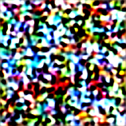

# Ternary Stable Diffusion
Apply ternary quantization to Stable Diffusion UNet for 15x compression
- Target: 4GB → 300MB model size
- Use case: Mobile and edge deployment
- Status: Research/Development

## 🎉 Proof of Concept Results

### First Ternary Image Generated (v0.1.0)

**Compression Achieved:**
- Original UNet (FP16): 327.8 MB
- Ternary UNet (2.5-bit): 21.9 MB
- **Compression Ratio: 15.0x** ✅

**Technical Details:**
- Model: Stable Diffusion v1.5
- Layers Converted: 282 (98 Conv2d, 184 Linear)
- Quantization: {-1, 0, +1} ternary weights
- Activation: FP16 (maintained)

**Performance:**
- Conversion Time: 4.4 seconds
- Generation Time: 33.6 seconds (10 steps, CPU)
- Device: CPU-compatible (no GPU required)

**Deployment Potential:**
- ✅ Mobile devices (22MB model size)
- ✅ Edge computing
- ✅ Privacy-first (on-device generation)
- ✅ Cost-effective (zero cloud costs)

*Generated with ternary-quantized Stable Diffusion v1.5*